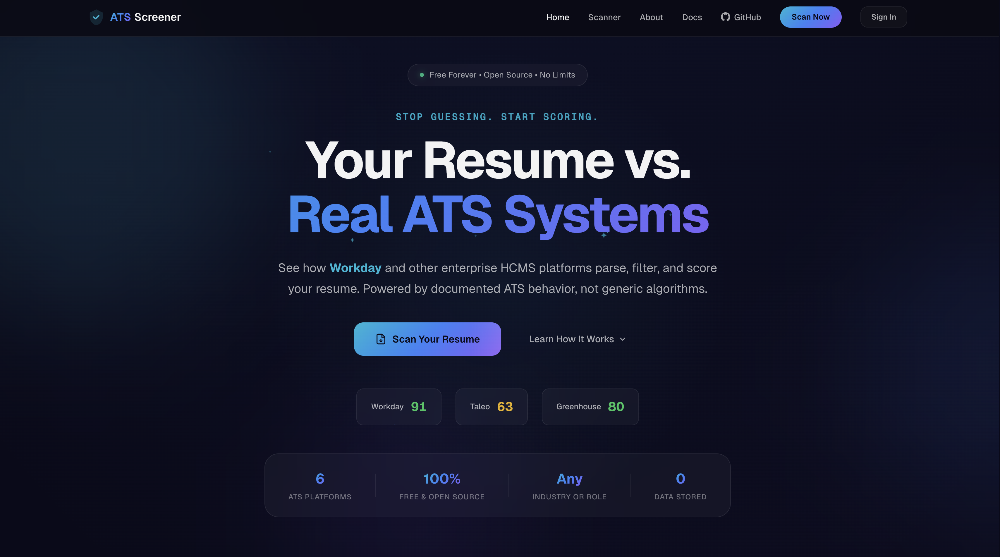

<p align="center">
  <a href="https://ats-screener.vercel.app">
    
  </a>
</p>

<p align="center">
  
  
  
  
  
</p>

<h1 align="center">ATS Screener</h1>

<p align="center">
  <strong>Free, open-source resume screener that simulates how 6 real enterprise ATS platforms parse, filter, and score your resume.</strong>
</p>

<p align="center">
  Workday &bull; Taleo (Oracle) &bull; iCIMS &bull; Greenhouse &bull; Lever &bull; SuccessFactors (SAP)
</p>

<p align="center">
  <a href="https://ats-screener.vercel.app">Live App</a> &bull;
  <a href="https://ats-screener.vercel.app/docs">Documentation</a> &bull;
  <a href="https://github.com/sunnypatell/ats-screener/issues">Issues</a> &bull;
  <a href="https://github.com/sunnypatell/ats-screener/blob/main/CONTRIBUTING.md">Contribute</a>
</p>

---

## Why I Built This

I got tired of uploading my resume to "free ATS checkers" that would analyze it, show me a score preview, then lock the actual results behind a $30/month paywall. Every single one of them. They all give you one generic score based on made-up algorithms that have nothing to do with how real applicant tracking systems work.

The thing is, real ATS platforms don't all evaluate resumes the same way. Taleo does strict literal keyword matching. Greenhouse doesn't auto-score at all. iCIMS uses ML-based semantic matching. A single "ATS score" is meaningless if it doesn't tell you which system you're up against.

So I built ATS Screener to give students and job seekers what those paid tools won't: **6 honest scores from 6 real platforms**, completely free, completely open source. No paywall, no upsell, no "premium tier" hiding your results. Create a free account and start scanning. Your resume file is parsed entirely in your browser and never uploaded to any server.

> Built by [Sunny Patel](https://sunnypatel.net), a student who got tired of paying for meaningless ATS scores.

**Disclaimer:** This is a student research project. All scoring simulations are based on publicly available documentation and community reports. ATS Screener is not affiliated with or endorsed by any ATS vendor.

## How It Works

```
Resume (PDF/DOCX)  -->  Client-Side Parser  -->  Extracted Text  -->  Gemma/Gemini AI  -->  6 Platform Scores
                        (Web Worker)              (sections,          (server)        (formatting, keywords,
                        file never uploaded       skills, dates)                       experience, education)

Job Description (optional)  -->  Targeted Keyword Matching Against Each Platform's Strategy
```

1. **Upload your resume** (PDF or DOCX). Parsed entirely client-side in a Web Worker. The file itself is never uploaded.
2. **Optionally paste a job description** for targeted scoring with keyword matching.
3. **Get scored by 6 systems**, each with different weights for formatting, keywords, sections, experience, and education.
4. **See what to fix** with platform-specific suggestions ranked by impact, telling you exactly what to change and why.

## Platform Profiles

Each profile is based on research into the platform's documented parsing and matching behavior:

| Platform | Vendor | Keyword Strategy | Key Behavior |
| --- | --- | --- | --- |
| **Workday** | Workday | Exact + HiredScore AI | Strict parser, skips headers/footers, penalizes creative formats |
| **Taleo** | Oracle | Literal exact match | Strictest keyword matching, auto-reject via Req Rank |
| **iCIMS** | iCIMS | Semantic (ML-based) | Role Fit AI, grammar-based NLP parser, most forgiving |
| **Greenhouse** | Greenhouse | Semantic (LLM-based) | No auto-scoring by design, human review with scorecards |
| **Lever** | Employ | Stemming-based | No ranking, search-dependent, abbreviation-blind |
| **SuccessFactors** | SAP | Taxonomy normalization | Textkernel parser, Joule AI skills matching |

## Tech Stack

| Layer | Choice | Why |
| --- | --- | --- |
| **Framework** | SvelteKit 5 (Svelte 5 runes) | Compiled to vanilla JS, ~15KB runtime. No VDOM overhead. |
| **Styling** | Scoped CSS + CSS custom properties | Dark glassmorphic design. No Tailwind. Component-scoped. |
| **PDF Parsing** | pdfjs-dist (Web Worker) | Mozilla-maintained, fully client-side. |
| **DOCX Parsing** | mammoth | Client-side Word to text extraction. |
| **NLP** | Custom TF-IDF + tokenizer + skills taxonomy | Lightweight, browser-native, supports 8+ industries. |
| **LLM** | Gemma 3 27B (primary), Gemini 2.5 Flash (fallback) | 14,400 RPD free tier via Google Generative Language API. Groq + Cerebras available for self-host. |
| **Auth** | Firebase Authentication | Google + email/password sign-in. Free Spark plan. |
| **Storage** | Cloud Firestore | Scan history per user. Free Spark plan. |
| **Hosting** | Vercel | Free hobby tier. Edge functions for API. |
| **Testing** | Vitest + Playwright + @testing-library/svelte | Unit, integration, and E2E coverage. |

**Total infrastructure cost: $0.** Everything runs on free tiers.

## Quick Start

```bash
git clone https://github.com/sunnypatell/ats-screener.git
cd ats-screener
pnpm install
```

Copy `.env.example` to `.env` and add your API keys:

```bash
cp .env.example .env
# add GEMINI_API_KEY and PUBLIC_FIREBASE_* values
```

```bash
pnpm dev        # start dev server
pnpm test       # run tests
pnpm check      # typecheck
pnpm lint       # lint
pnpm build      # production build
```

## Project Structure

```
src/
├── routes/
│   ├── +page.svelte              # Landing page
│   ├── scanner/+page.svelte      # Scanner (upload, parse, score, results)
│   ├── login/+page.svelte        # Auth (Google + email/password)
│   ├── history/+page.svelte      # Scan history (past results)
│   └── api/analyze/+server.ts    # LLM proxy endpoint
├── lib/
│   ├── components/
│   │   ├── landing/              # Hero, Features, HowItWorks, Footer
│   │   ├── scoring/              # ScoreDashboard, ScoreCard, ScoreBreakdown
│   │   ├── upload/               # ResumeUploader, JobDescriptionInput
│   │   └── ui/                   # Navbar, UserMenu, AuthButton, Logo, animations
│   ├── engine/
│   │   ├── parser/               # PDF/DOCX parsing, section detection
│   │   ├── scorer/               # 6 ATS profiles + scoring engine
│   │   ├── nlp/                  # Tokenizer, TF-IDF, skills taxonomy
│   │   └── llm/                  # Gemini client, prompts, fallback
│   ├── stores/                   # Svelte 5 rune stores (auth, resume, scores)
│   └── styles/                   # CSS tokens, global styles
├── docs/                         # Astro Starlight documentation site
└── tests/                        # Vitest unit + integration tests
```

## Scoring Engine

Each ATS profile applies different weights to 5 scoring dimensions:

- **Formatting** - parseability, structure, ATS-friendliness
- **Keyword Match** - exact/fuzzy/semantic matching (varies by platform)
- **Sections** - presence of required sections (contact, experience, education, skills)
- **Experience** - quantified achievements, action verbs, recency
- **Education** - degree, field relevance, institution

Two modes: **General** (resume only) for ATS readiness, or **Targeted** (resume + job description) for role-specific keyword matching.

## Contributing

See [CONTRIBUTING.md](CONTRIBUTING.md) for development setup and contribution guidelines.

## Security

See [SECURITY.md](SECURITY.md) for vulnerability reporting. Resume files are parsed client-side and never uploaded. Extracted text is sent to Google Gemini for AI analysis.

## License

[MIT](LICENSE) - [Sunny Patel](https://sunnypatel.net)
